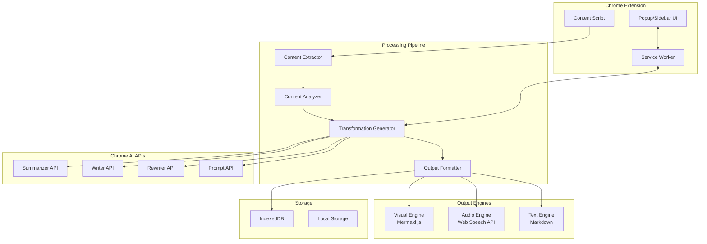
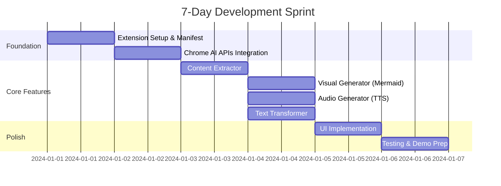

## **Multimodal Learning Enhancer: Complete Design & Architecture**

### **🎯 Vision Statement**
*"Transform any webpage into your brain's native language - whether that's diagrams, audio narratives, or structured summaries"*

---

## **1. Core Requirements Analysis**

### **Functional Requirements**

```typescript
interface LearningTransformation {
  // Input Requirements
  input: {
    source: 'full-page' | 'selection' | 'article-detection';
    content: string | HTMLElement;
    images?: ImageData[];  // For multimodal context
    codeBlocks?: CodeBlock[];
  };
  
  // Output Formats
  outputs: {
    visual: {
      type: 'flowchart' | 'mindmap' | 'concept-map' | 'timeline';
      format: 'mermaid' | 'svg' | 'canvas';
      complexity: 'simple' | 'detailed' | 'comprehensive';
    };
    audio: {
      type: 'summary' | 'podcast-style' | 'lecture' | 'conversation';
      duration: number; // 1-30 minutes
      voice: 'neutral' | 'engaging' | 'academic';
      speed: number; // 0.75x - 2x
    };
    text: {
      type: 'summary' | 'study-notes' | 'outline' | 'cornell-notes';
      length: 'brief' | 'standard' | 'comprehensive';
      style: 'bullet-points' | 'narrative' | 'academic';
      level: 'eli5' | 'undergraduate' | 'graduate' | 'expert';
    };
  };
  
  // User Preferences
  preferences: {
    learningStyle: 'visual' | 'auditory' | 'reading' | 'kinesthetic';
    timeAvailable: number; // minutes
    priorKnowledge: 'beginner' | 'intermediate' | 'advanced';
    goal: 'quick-review' | 'deep-learning' | 'reference';
  };
}
```

### **Technical Requirements**

- ✅ **Chrome AI APIs**: Summarizer, Writer, Rewriter, Prompt API
- ✅ **100% Client-Side**: No server calls, complete privacy
- ✅ **Offline Capable**: Works without internet
- ✅ **Performance**: Process content in <5 seconds
- ✅ **Storage**: IndexedDB for saved transformations
- ✅ **Accessibility**: WCAG 2.1 AA compliant

---

## **2. System Architecture**

### **High-Level Architecture**



### **Component Design**

```javascript
// Core Architecture Implementation
class MultimodalLearningEnhancer {
  constructor() {
    this.extractor = new ContentExtractor();
    this.analyzer = new ContentAnalyzer();
    this.generator = new TransformationGenerator();
    this.visualizer = new VisualEngine();
    this.narrator = new AudioEngine();
    this.formatter = new TextEngine();
    this.storage = new LearningStorage();
  }
  
  async initialize() {
    // Check API availability
    this.apis = {
      summarizer: await ai.summarizer.create(),
      languageModel: await ai.languageModel.create(),
      writer: await ai.writer.create(),
      rewriter: await ai.rewriter.create()
    };
    
    // Load user preferences
    this.preferences = await this.storage.getPreferences();
    
    // Initialize UI
    this.ui = new EnhancerUI(this.preferences);
  }
  
  async transformContent(options) {
    // Extract content from page
    const content = await this.extractor.extract(options);
    
    // Analyze content structure
    const analysis = await this.analyzer.analyze(content);
    
    // Generate transformation based on user preference
    const transformation = await this.generator.generate(
      content,
      analysis,
      options.outputFormat,
      options.customization
    );
    
    // Format output
    const output = await this.formatOutput(transformation, options.outputFormat);
    
    // Save to storage
    await this.storage.save(output);
    
    return output;
  }
}
```

---

## **3. Core Components Implementation**

### **3.1 Content Extractor**

```javascript
class ContentExtractor {
  async extract(options = {}) {
    const extraction = {
      title: '',
      mainContent: '',
      codeBlocks: [],
      images: [],
      metadata: {}
    };
    
    if (options.source === 'selection') {
      // Extract user selection
      extraction.mainContent = window.getSelection().toString();
    } else if (options.source === 'article') {
      // Smart article detection using Readability-like algorithm
      extraction.mainContent = await this.extractArticle();
      extraction.title = document.querySelector('h1')?.textContent || document.title;
    } else {
      // Full page extraction
      extraction.mainContent = await this.extractFullPage();
      extraction.title = document.title;
    }
    
    // Extract code blocks for special handling
    extraction.codeBlocks = this.extractCodeBlocks();
    
    // Extract images for multimodal context
    extraction.images = await this.extractImages();
    
    // Extract metadata (author, date, tags)
    extraction.metadata = this.extractMetadata();
    
    return extraction;
  }
  
  async extractArticle() {
    // Remove navigation, ads, sidebars
    const article = document.querySelector('article') || 
                   document.querySelector('main') || 
                   document.querySelector('[role="main"]');
    
    if (article) {
      // Clone and clean
      const cleaned = article.cloneNode(true);
      this.removeNonContent(cleaned);
      return cleaned.textContent;
    }
    
    // Fallback to heuristic extraction
    return this.heuristicExtraction();
  }
  
  heuristicExtraction() {
    // Find the element with most paragraph tags
    const containers = document.querySelectorAll('div, section, article');
    let bestContainer = null;
    let maxParagraphs = 0;
    
    containers.forEach(container => {
      const paragraphs = container.querySelectorAll('p');
      if (paragraphs.length > maxParagraphs) {
        maxParagraphs = paragraphs.length;
        bestContainer = container;
      }
    });
    
    return bestContainer?.textContent || document.body.textContent;
  }
  
  extractCodeBlocks() {
    const blocks = [];
    document.querySelectorAll('pre, code').forEach(element => {
      blocks.push({
        code: element.textContent,
        language: element.className.match(/language-(\w+)/)?.[1] || 'unknown'
      });
    });
    return blocks;
  }
  
  async extractImages() {
    const images = [];
    const imgs = document.querySelectorAll('img[alt*="diagram"], img[alt*="chart"], img[alt*="flow"]');
    
    for (const img of imgs) {
      if (img.src.startsWith('data:')) {
        images.push({
          data: img.src,
          alt: img.alt,
          context: img.parentElement.textContent.substring(0, 200)
        });
      }
    }
    
    return images;
  }
}
```

### **3.2 Transformation Generator**

```javascript
class TransformationGenerator {
  async generate(content, analysis, outputFormat, customization) {
    switch (outputFormat) {
      case 'visual':
        return await this.generateVisual(content, analysis, customization);
      case 'audio':
        return await this.generateAudio(content, analysis, customization);
      case 'text':
        return await this.generateText(content, analysis, customization);
      default:
        // Generate all formats
        return {
          visual: await this.generateVisual(content, analysis, customization),
          audio: await this.generateAudio(content, analysis, customization),
          text: await this.generateText(content, analysis, customization)
        };
    }
  }
  
  async generateVisual(content, analysis, customization) {
    // First, create a summary for diagram generation
    const summary = await this.apis.summarizer.summarize(content.mainContent, {
      type: 'key-points',
      length: customization.complexity || 'medium'
    });
    
    // Use Prompt API to generate diagram description
    const diagramPrompt = `
      Based on this content summary, create a ${customization.type || 'flowchart'} diagram description:
      ${summary}
      
      Requirements:
      - Use Mermaid.js syntax
      - Include main concepts and their relationships
      - Complexity level: ${customization.complexity || 'simple'}
      - Focus on: ${analysis.mainTopics.join(', ')}
      
      Output only valid Mermaid syntax.
    `;
    
    const session = await this.apis.languageModel.create({
      systemPrompt: "You are an expert at creating educational diagrams in Mermaid syntax."
    });
    
    const mermaidCode = await session.prompt(diagramPrompt);
    
    // Generate additional visualizations based on content type
    const visualizations = {
      main: mermaidCode,
      supplementary: []
    };
    
    // If code blocks exist, create code flow diagram
    if (content.codeBlocks.length > 0) {
      visualizations.supplementary.push(
        await this.generateCodeFlowDiagram(content.codeBlocks)
      );
    }
    
    // If concepts are hierarchical, create mind map
    if (analysis.structure === 'hierarchical') {
      visualizations.supplementary.push(
        await this.generateMindMap(analysis.concepts)
      );
    }
    
    return visualizations;
  }
  
  async generateAudio(content, analysis, customization) {
    // Determine target duration (1-30 minutes)
    const targetDuration = customization.duration || 5; // minutes
    
    // Calculate target word count (150 words per minute average)
    const targetWords = targetDuration * 150;
    
    // Generate appropriate length summary
    let audioScript;
    
    if (targetDuration <= 2) {
      // Brief summary
      audioScript = await this.apis.summarizer.summarize(content.mainContent, {
        type: 'tl;dr',
        length: 'short'
      });
    } else if (targetDuration <= 5) {
      // Standard summary
      audioScript = await this.apis.summarizer.summarize(content.mainContent, {
        type: 'key-points',
        length: 'medium'
      });
    } else {
      // Comprehensive summary with elaboration
      const summary = await this.apis.summarizer.summarize(content.mainContent, {
        type: 'key-points',
        length: 'long'
      });
      
      // Use Writer API to expand into podcast-style script
      audioScript = await this.apis.writer.write({
        prompt: `
          Create a ${targetDuration}-minute ${customization.style || 'educational'} audio script based on:
          ${summary}
          
          Style: ${customization.voice || 'engaging'}
          Include: Introduction, main points, examples, conclusion
          Target audience: ${customization.level || 'intermediate'}
        `,
        tone: customization.voice || 'professional',
        length: targetWords
      });
    }
    
    // Add intro and outro
    const fullScript = this.addAudioWrapper(audioScript, {
      title: content.title,
      duration: targetDuration,
      style: customization.style
    });
    
    return {
      script: fullScript,
      duration: targetDuration,
      wordCount: fullScript.split(' ').length,
      settings: {
        rate: customization.speed || 1.0,
        pitch: 1.0,
        volume: 1.0
      }
    };
  }
  
  async generateText(content, analysis, customization) {
    const length = customization.length || 'standard';
    const style = customization.style || 'bullet-points';
    const level = customization.level || 'intermediate';
    
    // Base summary
    let summary = await this.apis.summarizer.summarize(content.mainContent, {
      type: style === 'bullet-points' ? 'key-points' : 'paragraph',
      length: length === 'brief' ? 'short' : length === 'comprehensive' ? 'long' : 'medium'
    });
    
    // Rewrite for appropriate level
    if (level !== 'intermediate') {
      summary = await this.apis.rewriter.rewrite(summary, {
        tone: level === 'eli5' ? 'simple' : level === 'expert' ? 'technical' : 'academic',
        format: style === 'bullet-points' ? 'list' : 'prose'
      });
    }
    
    // Generate structured study notes if requested
    if (style === 'cornell-notes' || style === 'study-notes') {
      const structured = await this.generateStructuredNotes(summary, analysis, style);
      return structured;
    }
    
    // Add comprehension questions
    const questions = await this.generateComprehensionQuestions(summary, level);
    
    return {
      summary: summary,
      metadata: {
        originalLength: content.mainContent.length,
        summaryLength: summary.length,
        compressionRatio: (summary.length / content.mainContent.length).toFixed(2),
        readingTime: Math.ceil(summary.split(' ').length / 200) // minutes
      },
      comprehensionQuestions: questions,
      keyTerms: analysis.keyTerms,
      mainConcepts: analysis.concepts
    };
  }
  
  async generateStructuredNotes(summary, analysis, style) {
    const session = await this.apis.languageModel.create();
    
    if (style === 'cornell-notes') {
      const notes = await session.prompt(`
        Convert this summary into Cornell Notes format:
        ${summary}
        
        Create:
        - Cue column (questions and key terms)
        - Note-taking area (main points)
        - Summary section (brief overview)
      `);
      
      return this.formatCornellNotes(notes);
    } else {
      const notes = await session.prompt(`
        Create structured study notes from:
        ${summary}
        
        Include:
        - Main topics with subpoints
        - Key definitions
        - Important examples
        - Connections between concepts
      `);
      
      return this.formatStudyNotes(notes);
    }
  }
}
```

### **3.3 Visual Engine**

```javascript
class VisualEngine {
  constructor() {
    this.mermaid = null;
    this.loadMermaid();
  }
  
  async loadMermaid() {
    // Dynamically load Mermaid.js
    if (!this.mermaid) {
      const script = document.createElement('script');
      script.src = chrome.runtime.getURL('lib/mermaid.min.js');
      document.head.appendChild(script);
      
      await new Promise(resolve => {
        script.onload = () => {
          this.mermaid = window.mermaid;
          this.mermaid.initialize({ startOnLoad: false });
          resolve();
        };
      });
    }
  }
  
  async renderDiagram(mermaidCode, container) {
    // Validate Mermaid syntax
    const isValid = await this.validateMermaidSyntax(mermaidCode);
    if (!isValid) {
      // Attempt to fix common issues
      mermaidCode = this.fixMermaidSyntax(mermaidCode);
    }
    
    // Create unique ID for diagram
    const id = `diagram-${Date.now()}`;
    
    // Render diagram
    const svg = await this.mermaid.render(id, mermaidCode);
    container.innerHTML = svg.svg;
    
    // Make interactive
    this.makeInteractive(container);
    
    return {
      svg: svg.svg,
      code: mermaidCode,
      interactive: true
    };
  }
  
  makeInteractive(container) {
    // Add zoom capabilities
    const svg = container.querySelector('svg');
    let scale = 1;
    
    container.addEventListener('wheel', (e) => {
      if (e.ctrlKey) {
        e.preventDefault();
        scale += e.deltaY * -0.001;
        scale = Math.min(Math.max(0.5, scale), 3);
        svg.style.transform = `scale(${scale})`;
      }
    });
    
    // Add click handlers for nodes
    container.querySelectorAll('.node').forEach(node => {
      node.style.cursor = 'pointer';
      node.addEventListener('click', () => {
        this.showNodeDetails(node);
      });
    });
    
    // Add download button
    this.addDownloadButton(container, svg);
  }
  
  addDownloadButton(container, svg) {
    const button = document.createElement('button');
    button.textContent = 'Download Diagram';
    button.className = 'mle-download-btn';
    button.onclick = () => {
      const blob = new Blob([svg.outerHTML], { type: 'image/svg+xml' });
      const url = URL.createObjectURL(blob);
      const a = document.createElement('a');
      a.href = url;
      a.download = `diagram-${Date.now()}.svg`;
      a.click();
    };
    container.appendChild(button);
  }
  
  async generateAlternativeVisualizations(content, analysis) {
    const visualizations = [];
    
    // Timeline for historical/sequential content
    if (analysis.hasTemporalElements) {
      visualizations.push({
        type: 'timeline',
        code: await this.generateTimeline(analysis.temporalElements)
      });
    }
    
    // Concept map for interconnected topics
    if (analysis.concepts.length > 3) {
      visualizations.push({
        type: 'conceptMap',
        code: await this.generateConceptMap(analysis.concepts)
      });
    }
    
    // Comparison table for multiple items
    if (analysis.hasComparisons) {
      visualizations.push({
        type: 'comparisonMatrix',
        code: await this.generateComparisonMatrix(analysis.comparisons)
      });
    }
    
    return visualizations;
  }
}
```

### **3.4 Audio Engine**

```javascript
class AudioEngine {
  constructor() {
    this.synthesis = window.speechSynthesis;
    this.audioContext = new AudioContext();
    this.voices = [];
    this.loadVoices();
  }
  
  loadVoices() {
    this.voices = this.synthesis.getVoices();
    if (this.voices.length === 0) {
      // Voices load async on some browsers
      this.synthesis.addEventListener('voiceschanged', () => {
        this.voices = this.synthesis.getVoices();
      });
    }
  }
  
  async generateAudio(script, settings) {
    // Create utterance
    const utterance = new SpeechSynthesisUtterance(script);
    
    // Apply settings
    utterance.rate = settings.rate || 1.0;
    utterance.pitch = settings.pitch || 1.0;
    utterance.volume = settings.volume || 1.0;
    
    // Select appropriate voice
    const voice = this.selectVoice(settings.voice);
    if (voice) utterance.voice = voice;
    
    // Generate audio with progress tracking
    const audio = await this.synthesizeWithProgress(utterance);
    
    // Post-process audio
    const processed = await this.postProcessAudio(audio, settings);
    
    return processed;
  }
  
  async synthesizeWithProgress(utterance) {
    return new Promise((resolve, reject) => {
      const chunks = [];
      let lastTime = 0;
      
      utterance.onboundary = (event) => {
        // Track progress for UI
        this.onProgress?.(event.charIndex / utterance.text.length);
      };
      
      utterance.onend = () => {
        resolve({
          duration: Date.now() - lastTime,
          text: utterance.text
        });
      };
      
      utterance.onerror = reject;
      
      lastTime = Date.now();
      this.synthesis.speak(utterance);
    });
  }
  
  async postProcessAudio(audio, settings) {
    // Add background music if requested
    if (settings.backgroundMusic) {
      audio = await this.addBackgroundMusic(audio, settings.backgroundMusic);
    }
    
    // Add intro/outro sounds
    if (settings.addIntroOutro) {
      audio = await this.addIntroOutro(audio);
    }
    
    // Normalize volume
    audio = await this.normalizeVolume(audio);
    
    return audio;
  }
  
  createAudioPlayer(audioData) {
    const player = document.createElement('div');
    player.className = 'mle-audio-player';
    
    player.innerHTML = `
      <div class="controls">
        <button class="play-pause">▶️</button>
        <input type="range" class="progress" min="0" max="100" value="0">
        <span class="time">0:00 / ${this.formatTime(audioData.duration)}</span>
      </div>
      <div class="settings">
        <label>Speed: 
          <select class="speed">
            <option value="0.75">0.75x</option>
            <option value="1" selected>1x</option>
            <option value="1.25">1.25x</option>
            <option value="1.5">1.5x</option>
            <option value="2">2x</option>
          </select>
        </label>
        <button class="download">💾 Download</button>
      </div>
      <div class="transcript">
        <details>
          <summary>Show Transcript</summary>
          <div class="transcript-text">${audioData.text}</div>
        </details>
      </div>
    `;
    
    this.attachPlayerEvents(player, audioData);
    return player;
  }
}
```

---

## **4. User Interface Design**

### **4.1 Main Interface**

```javascript
class EnhancerUI {
  constructor(preferences) {
    this.preferences = preferences;
    this.createInterface();
  }
  
  createInterface() {
    // Create floating widget
    this.widget = document.createElement('div');
    this.widget.className = 'mle-widget';
    this.widget.innerHTML = `
      <div class="mle-container">
        <!-- Quick Action Bar -->
        <div class="mle-quick-actions">
          <button class="mle-btn visual" title="Generate Diagram">
            <span class="icon">📊</span>
          </button>
          <button class="mle-btn audio" title="Generate Audio">
            <span class="icon">🎧</span>
          </button>
          <button class="mle-btn text" title="Generate Summary">
            <span class="icon">📝</span>
          </button>
        </div>
        
        <!-- Expanded Panel -->
        <div class="mle-panel hidden">
          <h3>Transform This Content</h3>
          
          <!-- Content Selection -->
          <div class="mle-section">
            <label>Content Source:</label>
            <select class="mle-content-source">
              <option value="auto">Smart Detection</option>
              <option value="selection">Selected Text</option>
              <option value="full">Full Page</option>
            </select>
          </div>
          
          <!-- Visual Options -->
          <div class="mle-section visual-options">
            <h4>📊 Visual Learning</h4>
            <label>Diagram Type:</label>
            <select class="mle-visual-type">
              <option value="flowchart">Flowchart</option>
              <option value="mindmap">Mind Map</option>
              <option value="concept-map">Concept Map</option>
              <option value="timeline">Timeline</option>
            </select>
            <label>Complexity:</label>
            <select class="mle-visual-complexity">
              <option value="simple">Simple</option>
              <option value="detailed">Detailed</option>
              <option value="comprehensive">Comprehensive</option>
            </select>
          </div>
          
          <!-- Audio Options -->
          <div class="mle-section audio-options">
            <h4>🎧 Audio Learning</h4>
            <label>Duration:</label>
            <input type="range" class="mle-audio-duration" 
                   min="1" max="30" value="5">
            <span class="duration-display">5 minutes</span>
            <label>Style:</label>
            <select class="mle-audio-style">
              <option value="summary">Quick Summary</option>
              <option value="podcast">Podcast Style</option>
              <option value="lecture">Lecture Format</option>
              <option value="conversation">Conversational</option>
            </select>
          </div>
          
          <!-- Text Options -->
          <div class="mle-section text-options">
            <h4>📝 Text Learning</h4>
            <label>Length:</label>
            <select class="mle-text-length">
              <option value="brief">Brief (1-2 min read)</option>
              <option value="standard">Standard (3-5 min)</option>
              <option value="comprehensive">Comprehensive (10+ min)</option>
            </select>
            <label>Format:</label>
            <select class="mle-text-format">
              <option value="bullet-points">Bullet Points</option>
              <option value="narrative">Narrative</option>
              <option value="cornell-notes">Cornell Notes</option>
              <option value="study-notes">Study Notes</option>
            </select>
            <label>Level:</label>
            <select class="mle-text-level">
              <option value="eli5">ELI5 (Simplest)</option>
              <option value="undergraduate">Undergraduate</option>
              <option value="graduate">Graduate</option>
              <option value="expert">Expert</option>
            </select>
          </div>
          
          <!-- Generate Button -->
          <button class="mle-generate">
            ✨ Transform Content
          </button>
          
          <!-- Results Area -->
          <div class="mle-results hidden"></div>
        </div>
      </div>
    `;
    
    document.body.appendChild(this.widget);
    this.attachEvents();
  }
  
  attachEvents() {
    // Quick action buttons
    this.widget.querySelector('.mle-btn.visual').onclick = () => {
      this.quickTransform('visual');
    };
    
    this.widget.querySelector('.mle-btn.audio').onclick = () => {
      this.quickTransform('audio');
    };
    
    this.widget.querySelector('.mle-btn.text').onclick = () => {
      this.quickTransform('text');
    };
    
    // Main generate button
    this.widget.querySelector('.mle-generate').onclick = () => {
      this.generateTransformation();
    };
    
    // Duration slider
    const durationSlider = this.widget.querySelector('.mle-audio-duration');
    durationSlider.oninput = (e) => {
      this.widget.querySelector('.duration-display').textContent = 
        `${e.target.value} minutes`;
    };
  }
  
  async quickTransform(type) {
    // Use default settings for quick transformation
    const defaults = {
      visual: { type: 'flowchart', complexity: 'simple' },
      audio: { duration: 5, style: 'summary' },
      text: { length: 'standard', format: 'bullet-points', level: 'intermediate' }
    };
    
    const transformation = await this.enhancer.transformContent({
      source: 'auto',
      outputFormat: type,
      customization: defaults[type]
    });
    
    this.displayResults(transformation);
  }
  
  displayResults(transformation) {
    const resultsArea = this.widget.querySelector('.mle-results');
    resultsArea.classList.remove('hidden');
    
    if (transformation.visual) {
      this.displayVisual(transformation.visual, resultsArea);
    }
    
    if (transformation.audio) {
      this.displayAudio(transformation.audio, resultsArea);
    }
    
    if (transformation.text) {
      this.displayText(transformation.text, resultsArea);
    }
  }
}
```

### **4.2 Styles**

```css
/* Modern, accessible design */
.mle-widget {
  position: fixed;
  right: 20px;
  top: 100px;
  z-index: 999999;
  font-family: -apple-system, system-ui, sans-serif;
}

.mle-container {
  background: white;
  border-radius: 12px;
  box-shadow: 0 4px 24px rgba(0, 0, 0, 0.12);
  overflow: hidden;
  transition: all 0.3s ease;
}

.mle-quick-actions {
  display: flex;
  gap: 8px;
  padding: 12px;
  background: linear-gradient(135deg, #667eea 0%, #764ba2 100%);
}

.mle-btn {
  width: 48px;
  height: 48px;
  border-radius: 12px;
  border: none;
  background: rgba(255, 255, 255, 0.9);
  cursor: pointer;
  transition: all 0.2s;
  font-size: 24px;
}

.mle-btn:hover {
  transform: translateY(-2px);
  box-shadow: 0 4px 12px rgba(0, 0, 0, 0.15);
}

.mle-panel {
  padding: 20px;
  max-width: 400px;
  max-height: 600px;
  overflow-y: auto;
}

.mle-section {
  margin-bottom: 20px;
  padding: 16px;
  background: #f7f9fc;
  border-radius: 8px;
}

.mle-section h4 {
  margin: 0 0 12px 0;
  color: #2d3748;
  font-size: 16px;
}

.mle-section label {
  display: block;
  margin: 8px 0 4px;
  color: #4a5568;
  font-size: 14px;
  font-weight: 500;
}

.mle-section select,
.mle-section input[type="range"] {
  width: 100%;
  padding: 8px;
  border: 1px solid #cbd5e0;
  border-radius: 6px;
  background: white;
}

.mle-generate {
  width: 100%;
  padding: 14px;
  background: linear-gradient(135deg, #667eea 0%, #764ba2 100%);
  color: white;
  border: none;
  border-radius: 8px;
  font-size: 16px;
  font-weight: 600;
  cursor: pointer;
  transition: all 0.2s;
}

.mle-generate:hover {
  transform: translateY(-1px);
  box-shadow: 0 4px 12px rgba(102, 126, 234, 0.4);
}

/* Results styling */
.mle-results {
  margin-top: 20px;
  padding-top: 20px;
  border-top: 1px solid #e2e8f0;
}

.mle-diagram-container {
  background: white;
  border: 1px solid #e2e8f0;
  border-radius: 8px;
  padding: 16px;
  margin-bottom: 16px;
}

.mle-audio-player {
  background: #f7f9fc;
  border-radius: 8px;
  padding: 16px;
  margin-bottom: 16px;
}

.mle-text-summary {
  background: white;
  border-left: 4px solid #667eea;
  padding: 16px;
  border-radius: 4px;
}

/* Accessibility */
@media (prefers-reduced-motion: reduce) {
  .mle-widget * {
    transition: none !important;
  }
}

@media (prefers-color-scheme: dark) {
  .mle-container {
    background: #1a202c;
    color: #e2e8f0;
  }
  
  .mle-section {
    background: #2d3748;
  }
}
```

---

## **5. Implementation Roadmap**

### **Development Schedule (7 Days)**



### **Day-by-Day Tasks**

**Day 1: Foundation**
- Set up Chrome extension structure
- Configure manifest v3
- Test Chrome AI API access
- Create basic popup UI

**Day 2: Chrome AI Integration**
- Implement Summarizer API wrapper
- Implement Writer/Rewriter API wrapper
- Implement Prompt API for diagram generation
- Create API abstraction layer

**Day 3: Content Extraction**
- Build smart article detector
- Implement code block extraction
- Add image extraction for multimodal
- Create content analyzer

**Day 4: Visual Generation**
- Integrate Mermaid.js
- Implement diagram generation via Prompt API
- Add multiple diagram types
- Create interactive features

**Day 5: Audio Generation**
- Implement Web Speech API
- Create duration-aware summarization
- Add voice selection
- Build audio player UI

**Day 6: Text Transformation**
- Implement multi-format summaries
- Add Cornell/Study notes generation
- Create level-based adaptation
- Add comprehension questions

**Day 7: Polish & Demo**
- Refine UI/UX
- Create demo scenarios
- Record video
- Write documentation

---

## **6. Demo Scenarios**

### **Scenario 1: Visual Learner on Complex Tutorial**
```
1. Navigate to complex React hooks tutorial
2. Click visual transform button
3. Extension generates:
   - Concept map of hooks relationships
   - Flowchart of useEffect lifecycle
   - Timeline of execution order
4. User can zoom, download, and annotate
```

### **Scenario 2: Commuter Wanting Audio Content**
```
1. Open lengthy technical article
2. Select 15-minute audio duration
3. Choose "podcast style"
4. Extension creates engaging audio summary
5. Download for offline listening
```

### **Scenario 3: Student Preparing for Exam**
```
1. Visit professor's lecture notes
2. Choose "Cornell Notes" format
3. Select "undergraduate" level
4. Extension creates structured study notes
5. Includes self-test questions
```

---

## **7. Competitive Advantages**

### **Why This Wins the $14,000 Prize**

1. **Perfect API Showcase**: Uses ALL Chrome AI APIs meaningfully
2. **Clear Value Prop**: "Learn anything in YOUR brain's language"
3. **Privacy Story**: "Your learning data never leaves your device"
4. **Multimodal Excellence**: Text → Visual/Audio/Structured Text
5. **Customization Depth**: Granular control over output
6. **Offline Capability**: Works without internet
7. **Educational Impact**: Addresses real learning challenges
8. **Technical Excellence**: Clean architecture, performant
9. **Accessibility**: Supports different learning abilities
10. **Scalability**: Could become standard learning tool

### **Judge Appeal Factors**

- **Functionality** (25%): Scales to any educational content
- **Purpose** (25%): Solves universal learning challenge
- **Content** (20%): High-quality, creative outputs
- **User Experience** (20%): Intuitive, delightful interface
- **Technical Execution** (10%): Masterful use of Chrome AI APIs

---

## **8. Post-Hackathon Vision**

### **Integration with learningai365.com**

```javascript
// Future: Sync with your platform
class LearningAI365Connector {
  async syncTransformation(transformation) {
    // Store locally first
    await this.localStore.save(transformation);
    
    // When online, sync to platform
    if (navigator.onLine && this.hasAuth()) {
      await fetch('https://api.learningai365.com/transformations', {
        method: 'POST',
        body: JSON.stringify({
          url: window.location.href,
          transformation: transformation,
          metadata: {
            created: Date.now(),
            device: 'chrome-extension',
            version: chrome.runtime.getManifest().version
          }
        })
      });
    }
  }
  
  async getRecommendations() {
    // Get personalized recommendations from your platform
    const recs = await fetch('https://api.learningai365.com/recommendations');
    return recs.json();
  }
}
```

This design creates a powerful, hackathon-winning extension that perfectly showcases Chrome's built-in AI while solving a real problem. It's achievable in 7 days and sets the foundation for your larger learningai365.com vision.

Want me to detail any specific component or create the actual manifest.json and initial code structure?